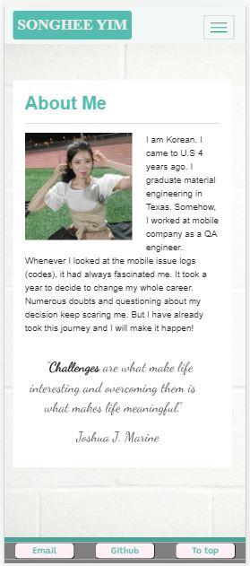
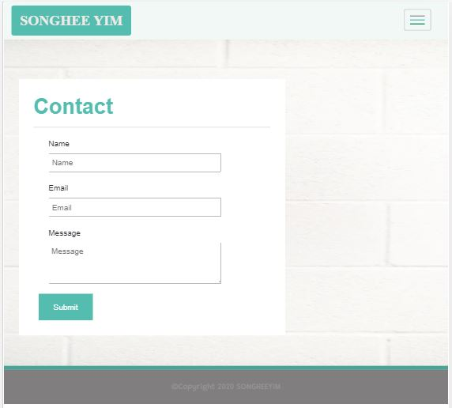
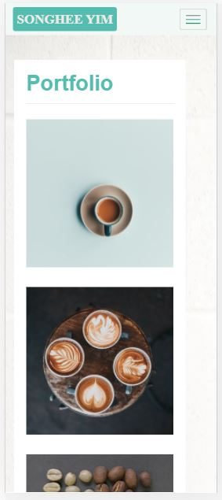

# FirstProject_Portfolio

## Description
The main purpose of this project is to make WebPage using bootstrap. Most of html element has bootstrap grid layout and functions. There are total 3 pages in this project and each has individual style sheet. Short introduction about me described in ABOUT ME page, and click the sticky footer button on *mobile screen* to contact me if you want to. Or you can leave contact information in the CONTACT page. PORTFOLIO page pictures will be updated later. 
>The images in the PORTFOLIO page are *NON-COPYRIGHT* images.    
>CREATED BY @Songhee95 feel free to contact me!

## Table of Contents
* [URLs](#URLs)
* [Usage](#usage)
* [Credits](#credits)
* [License](#license)

## URLs
1. Deployed URL
    https://songhee95.github.io/horiseon-code-refactor/

2. Github Page URL
    [Github](https://github.com/Songhee95/horiseon-code-refactor)

## Usage

## Awesome Features
*Nav bar was drawn with <svg> element to customize the nav button style which lines have different colors.

## License
*MIT License*
Copyright (c) [2020] [SongheeYim]

Permission is hereby granted, free of charge, to any person obtaining a copy
of this software and associated documentation files (the "Software"), to deal
in the Software without restriction, including without limitation the rights
to use, copy, modify, merge, publish, distribute, sublicense, and/or sell
copies of the Software, and to permit persons to whom the Software is
furnished to do so, subject to the following conditions:

The above copyright notice and this permission notice shall be included in all
copies or substantial portions of the Software.

THE SOFTWARE IS PROVIDED "AS IS", WITHOUT WARRANTY OF ANY KIND, EXPRESS OR
IMPLIED, INCLUDING BUT NOT LIMITED TO THE WARRANTIES OF MERCHANTABILITY,
FITNESS FOR A PARTICULAR PURPOSE AND NONINFRINGEMENT. IN NO EVENT SHALL THE
AUTHORS OR COPYRIGHT HOLDERS BE LIABLE FOR ANY CLAIM, DAMAGES OR OTHER
LIABILITY, WHETHER IN AN ACTION OF CONTRACT, TORT OR OTHERWISE, ARISING FROM,
OUT OF OR IN CONNECTION WITH THE SOFTWARE OR THE USE OR OTHER DEALINGS IN THE
SOFTWARE.
